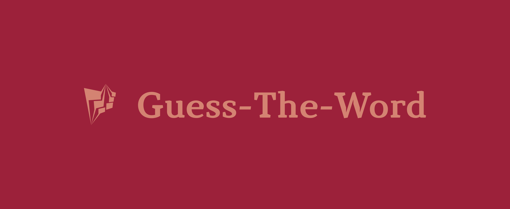

# Welcome to Guess-The-Word

# About the game

This is a game related to asking questions to the user related to subjects and cities. You have the right to an unlimited number of mistakes, and a word always  must start with a capital letter. At the end of each game you have the right to start a new one or give up
Guess-the-word®

# Participants

•Kameliya Yaneva - Scrum Trainer <a href="mailto:KKYaneva19@codingburgas.bg">Send email</a>  
•Vesela Dekova - Code Checker <a href="mailto:VBDekova19@codingburgas.bg">Send email</a>    
•Andrey Andreev - Developer Front-end <a href="mailto:AGAndreev19@codingburgas.bg">Send email</a>   
•Petya Petkova - Developer Back-end  <a href="mailto:PIPetkova19@codingburgas.bg">Send email</a>    
•Kaloyan Pazlamachev - Q&A engineer <a href="mailto:KNPazlamachev19@codingburgas.bg">Send email</a>   

# Function list

 changeQuestions1() - Changes the questions for first level

changeQuestions2() - Changes the questions for second level

changeQuestions3() - Changes the questions for third level

changeWords1() - Goes from one word to another on the first level

changeWords2() - Goes from one word to another on the second level

changeWords3() - Goes from one word to another on the third level

check() - This function checks if you typed the correct word

drawFisrtRow_1, drawSecondRow_1 - It shows you the correct word and each letter is drawn in separate box for first level

drawFirstRow_2, drawSecondRow_2 - It shows you the correct word and each letter is drawn in separate box for second level

drawFirstRow_3, drawSecondRow_3 - It shows you the correct word and each letter is drawn in separate box for third level

mainMenu() - Shows you the main menu where you can choose to either Start a game, see the rules or quit the game

game() - Changes the levels

startMenu() - Shows you the start menu

# Future ideas

•To create new levels for example 4 level will be for movies and 5 level for celebrities. 

•We also want to add color. For example when you type the correct word it will become green and to make the menu purple. 

# Here is how to download our repo:
git clone https://github.com/KKYaneva19/Guess-The-Word.git

# Have fun playing!

